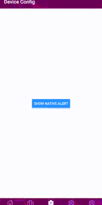

This is a Bridging Challenge [**React Native**](https://reactnative.dev) project.


# Overview
In the real world projects you may face some situation that you will be have to write native codes, this situation may be;

a) the client project has been developed with swift/kotlin and he decides to continue rest of project with react native.

b) there may be a situation that you won't be able to handle it with react native (utilizin some low-level features such as bluetooth, NFC, payment SDK, etc)

Let's see how you can handle these situations step by step:

1. The React Native (JavaScript) Side

```js

import { NativeModules, TouchableOpacity, Text, Button, View } from 'react-native';

const { DeviceDataModule } = NativeModules; // (1) Get a reference to our native module

const DeviceConfigScreen = () => {
  const handlePress = () => {
    // (2) Call the exposed native method
    if (DeviceDataModule && DeviceDataModule.showToast) {
      DeviceDataModule.showToast("1133456"); // (3) Pass data to native
    }
  };

  return (
    <View style={{ flex: 1, justifyContent: 'center', alignItems: 'center' }}>
    <TouchableOpacity onPress={handlePress}> // (4) User presses button
      <Button title="Show Native Alert" onPress={handlePress} />
    </TouchableOpacity>
    </View>
  );
};
export default DeviceConfigScreen;
```
**What happens here:**

a) ```Const { DeviceDataModule } = NativeModules;```

By destructuring __AlertModule__ form __NativeModule__ , you are getting a js object that represents your native Koltin module.

```DeviceDataModule.ShowNativeAlert('Hello from Koltin);```  

This is the magic line!

+ The javascript code calls a method (```showNativeAlert```) on the ```DeviceDataModule``` object.
+ Since the ```DeviceDataModule``` is a __bridging Module__ , this isn't a regular js function call. Instead, React Native's __javascript bridge__ intercepts this call.
+ The string ```"1133456"``` is passed as an argument across the bridge.


__2. The JavaScript Bridge__

This is the core communication layer between the JavaScript thread (where your React Native code runs) and the Native UI thread (where Android components and Java/Kotlin code run).

When DeviceDataModule.showToast() is called in JS, the Bridge packages up the method name ("showToast") and its arguments ("Hello from Kotlin!") into a message.

This message is then sent from the JavaScript thread to the Native UI thread.


__3) Android/Koltin side - receiving the call__

```js
package com.fitnessApp

import android.widget.Toast
import com.facebook.react.bridge.ReactApplicationContext
import com.facebook.react.bridge.ReactContextBaseJavaModule
import com.facebook.react.bridge.ReactMethod

class DeviceDataModule(reactContext: ReactApplicationContext) : ReactContextBaseJavaModule(reactContext) {

    override fun getName(): String {
        return "DeviceDataModule" // This is the name exposed to JS
    }

    @ReactMethod
    fun showToast(message: String) {
        Toast.makeText(reactApplicationContext,
         "The device Id received in Koltin is: $message", Toast.LENGTH_SHORT).show()
    }
}

```


__What happens here:__

A.  ```override fun getName(): String { return "DeviceDataModule" }:``` This function is crucial. When React Native starts up, it asks all registered native modules for their names. This is how the ```NativeModules``` JavaScript object knows to create a property named ```DeviceDataModule``` that points to this specific Kotlin class.

B.  ```@ReactMethod:``` This annotation is like a public signpost for the JavaScript Bridge. It tells React Native, "Hey, this ```showToast``` method can be called directly from JavaScript!" Without this annotation, the method would be invisible to your React Native code.

C.  ```fun showNativeAlert(message: String):``` When the message arrives from the JavaScript Bridge, the native side looks for a method with the name ```showToast``` and the correct argument types (a String in this case). It then executes this Kotlin function.

D.  ```Toast.makeText(reactApplicationContext,  "The device Id received in Koltin is: $message", Toast.LENGTH_LONG).show():``` This is standard Android Kotlin code. It takes the ```message``` string that was passed from JavaScript and uses the ```showToast``` API to display a small, native alert on the Android device's screen.

__4. The Native Module Registration__

```js
package com.fitnessApp

import com.facebook.react.ReactPackage
import com.facebook.react.bridge.NativeModule
import com.facebook.react.bridge.ReactApplicationContext
import com.facebook.react.uimanager.ViewManager

class DeviceDataPackage : ReactPackage {
    override fun createNativeModules(reactContext: ReactApplicationContext): List<NativeModule> {
        return listOf(DeviceDataModule(reactContext))
    }

    override fun createViewManagers(reactContext: ReactApplicationContext): List<ViewManager<*, *>> {
        return emptyList()
    }
}
```js

// MainApplication.java (simplified)
```js
public class MainApplication extends Application implements ReactApplication {
    @Override
    protected List<ReactPackage> getPackages() {
        List<ReactPackage> packages = new PackageList(this).getPackages();
         add(DeviceDataPackage())
    }
    // ... other methods
}
```

__What happens here:__

E.  ```MyDeviceDataPackage.createNativeModules():``` When React Native is initializing its native modules, it calls this method on every ```ReactPackage``` you've registered. You return a list containing an instance of your ```DeviceDataModule```. This is how ```DeviceDataModule``` becomes known to the React Native runtime.


F.  ```MainApplication.getPackages():``` This is the very first place where your ```MyDeviceDataPackage``` gets plugged into the React Native system on Android. When the ```MainApplication``` (which is the entry point of your Android app) starts, it builds a list of all ```ReactPackages```. By adding ```new MyDeviceDataPackage()``` to this list, you ensure that ```MyDeviceDataPackage``` is discovered, and in turn, your ```DeviceDataModule``` is registered.

__In Summary: The Journey__

__JavaScript__ (App.js): You call DeviceDataModule.showNativeAlert("...").

__JS Bridge:__ Intercepts the call, packages it, and sends it to the native side.

__Android__ (```MainApplication.java``` -> ```MyDeviceDataPackage.kt```): The app's startup registers ```MyDeviceDataPackage```, which contains ```DeviceDataModule```.

__Android__ (```DeviceDataModule.kt```): The native side receives the message, finds the ```showNativeAlert``` method (thanks to ```@ReactMethod``` and ```getName()```), and executes it.

Native Android System: The ```Toast.makeText().show()``` command displays the alert on the screen.

This entire process happens very quickly, making it seem like a direct call, but it's the bridge and the module registration that make this cross-language communication possible!
