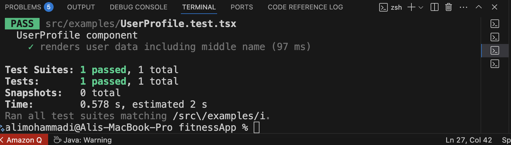

# Overview
Here is a situation where tests and CI/CD pipeline can save you by giving notification while the deploy fails and pipeline breaks so the new version will not be deployed to the production. In the project the client has decided to remove 'middleName' form his API so all the requests will receive all the userInformation without that specific field. This means if anyone clients (frontEnd, Mobile, etc) has used middleName field without some validation or controls in the screen you will see 'undefined' or an empty character if you are lucky but there are chances that app will crash if you have done some extra modificatins to your data such as (in this example the middleName is converted to upperCase .toUpperCase()).
When your app crashes, you may reckon that your users will contact you and ask you to please fix the bug however it is possible if they don't have any other alternatives but in real life they just type 'alternatives to <yourAppName> ' and find another app in a few seconds.


```json
//json data before removing the "middleName' field
{
  "user": {
    "firstName": "Ali",
    "middleName": "Reza",
    "lastName": "Mohammadi"
  }
}
```


__Now imagine API provider decide to remove middleName due to clarity, regulations or etc.__

```json
//json data after removing the "middleName' field
{
  "user": {
    "firstName": "Ali",
    "lastName": "Mohammadi"
  }
}
```
__Your app will crash if you don't have proper control and CICD pipelines don't warn you during the new version deployment__


__Your React Native component__

```js
// 1. React Native Component (UserProfile.tsx)
import React, { useEffect, useState } from 'react';
import { Text, View } from 'react-native';

export default function UserProfile() {
  const [user, setUser] = useState(null);

  useEffect(() => {
    fetch('http://10.0.2.2:3000/user')
      .then((res) => res.json())
      .then((data) => setUser(data))
      .catch((err) => console.error(err));
  }, []);

  if (!user) return <Text>Loading...</Text>;

  return (
    <View>
      <Text>First Name: {user.firstName}</Text>
      <Text>Middle Name: {user.middleName.toUpperCase()}</Text>
      <Text>Last Name: {user.lastName.toUpperCase()}</Text>
    </View>
  );
}
```

__Let's see how a test can save you before happening this inconvenient situation:__

```js
// 3. Test Case (UserProfile.test.tsx)
import React from 'react';
import { render, waitFor } from '@testing-library/react-native';
import UserProfile from './UserProfile';

//This can be use in the cases that we can't connect to API but we know its schema
// Mock fetch
// global.fetch = jest.fn(() =>
//   Promise.resolve({
//     json: () =>
//       Promise.resolve({
//         firstName: 'Ali',
//         middleName: 'Reza',
//         lastName: 'Mohammadi',
//       }),
//   })
// );

describe('UserProfile component', () => {
  it('renders user data including middle name', async () => {
    const { getByText } = render(<UserProfile />);

    await waitFor(() => {
      expect(getByText('First Name: Ali')).toBeTruthy();
      expect(getByText('Middle Name: Reza')).toBeTruthy();
      expect(getByText('Last Name: Mohammadi')).toBeTruthy();
    });
  });
});
```


__Your CICD will run this tests before deploying the new version of the app and deployment will fail due to the following errors:


__So you know what the problem is and you can update your code to prevent the crash.


in the 
```js 
UserProfile.tsx
``` 
replace this part

```js 
<Text> Middle Name: {user.middleName ? user.middleName.toUpperCase() : '-'}</Text>
```

and in the test replace this part 
```js 
expect(getByText('Middle Name: -')).toBeTruthy();
```
__So the tests will pass__


